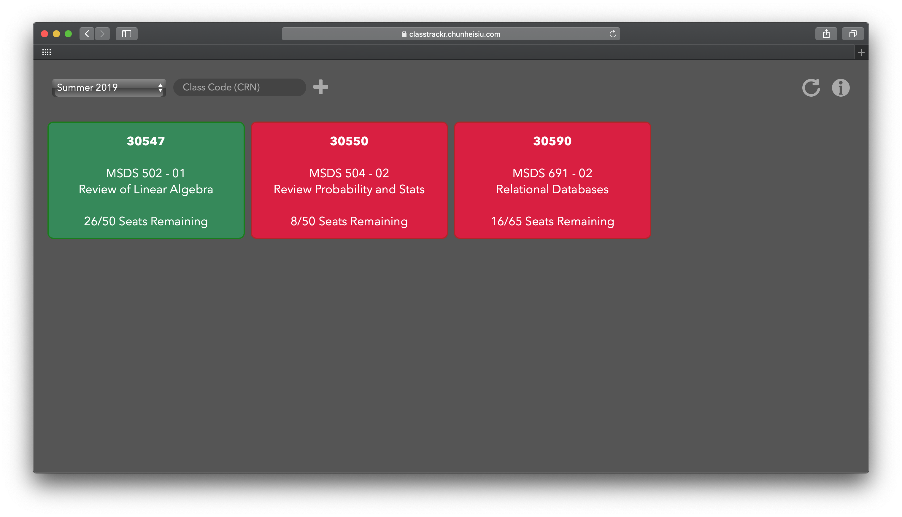

## ClassTrackr: Dashboard for Classes 🎓

This repository contains the source files for ClassTrackr, a client-side only web application for tracking the number of remaining seats in a particular course at the University of San Francisco.

### Instructions
To add a class that you wish to display in the dashboard, select the term/semester and enter its class code (CRN) in the text box and click the "Plus" sign. Alternatively, supplied the term/semester and the list of class codes, comma-separated, in the URL in the following format:

`https://classtrackr.chunheisiu.com/?term=<term>&classes=<crn1>,<crn2>...`

Note: `term` is the concatenation of the year and the semester. The codes for each semester in a year are as follows:
- **Fall**: `40`
- **Intersession/Winter**: `10`
- **Spring**: `20`
- **Summer**: `30`

For example, the term for *Summer 2019* is `201930`.

To preserve the list of currently displayed classes, simply bookmark the page in your browser.
